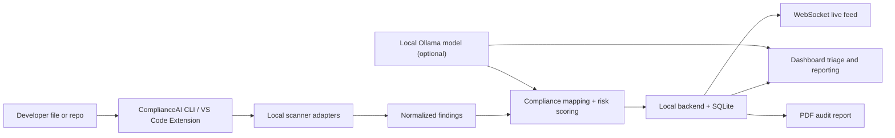

# ComplianceAI

ComplianceAI is a local-first AppSec and compliance product that brings security scanning, developer guidance, compliance mapping, and audit evidence into one workflow.

Instead of forcing teams to stitch together separate tools for SAST, SCA, secrets, IaC, containers, Kubernetes, IDE feedback, and audit reporting, this project combines:

- a multi-scanner CLI
- a React dashboard for posture, triage, and reporting
- a VS Code extension for in-editor feedback
- a local compliance intelligence layer that turns technical findings into business and audit context

The result is a product built for teams that want stronger security coverage without cloud lock-in, dashboard sprawl, or manual auditor mapping.

## Why This Product Exists

Modern AppSec programs are still fragmented.

Most organizations use one tool for code scanning, another for dependencies, another for secrets, another for IaC, another for containers, and yet another workflow for compliance and audit preparation. Even when vendors appear "platform-like", many still cover only part of the stack or act as orchestration layers across external engines.

That creates four recurring problems:

1. Teams juggle multiple scanners, dashboards, and alert streams.
2. Developers receive raw findings, but not enough context about why those findings matter.
3. Compliance teams still manually map vulnerabilities to laws, controls, and evidence packages.
4. Regulated organizations are hesitant to send source code or findings to cloud services.

ComplianceAI is designed to solve those gaps with one local workflow:

`scan -> enrich -> explain -> prioritize -> remediate -> document`

## Product Vision

ComplianceAI is not just another vulnerability viewer.

The product is designed to act as a shared operating layer for engineering, AppSec, and compliance teams:

- Developers get fast, understandable feedback close to where they write code.
- Security teams get normalized findings across multiple scan categories.
- Compliance teams get mapped controls, posture summaries, and audit-ready artifacts.
- Regulated organizations get a local deployment model without external SaaS dependency.

This repo already implements a meaningful portion of that vision today and also points clearly toward a stronger closed-loop remediation platform.

## Why ComplianceAI Is Different

The AppSec landscape typically splits into three buckets:

- point tools that scan one domain very well
- platforms that aggregate alerts but still depend on multiple products underneath
- cloud-first developer tools that help with speed but are harder to use in restricted environments

ComplianceAI takes a different position.

| Common market limitation | ComplianceAI approach |
| --- | --- |
| Separate tools for SAST, SCA, secrets, IaC, containers, and Kubernetes | One local workflow that fans out across multiple scanner categories |
| Findings stop at technical severity | Findings are enriched with compliance mappings, risk score, and plain-English explanations |
| Audit teams manually translate issues into controls | The system maps findings to frameworks such as SOC 2, GDPR, HIPAA, PCI-DSS, OWASP, and ISO 27001 |
| Security feedback appears too late in CI/CD | The product supports CLI, dashboard, and IDE workflows so issues can surface earlier |
| Cloud-first security tooling creates data residency concerns | Core product flow runs locally, with optional local AI through Ollama |
| Dashboards show counts but not evidence | The platform adds framework posture views, nightly snapshots, and PDF audit reporting |

## The Most Unique Product Strengths

### 1. Unified multi-domain coverage

Most tools specialize in one slice of AppSec. ComplianceAI is built around the idea that teams should not need separate operating models for:

- code vulnerabilities
- dependency and filesystem issues
- secrets exposure
- Terraform and infrastructure misconfigurations
- container risks
- Kubernetes security findings

The CLI layer normalizes outputs from multiple scanners into one result model so the rest of the product can treat them as one security dataset instead of many disconnected feeds.

### 2. Compliance-aware findings, not just scanner output

A raw severity score is not enough for auditors, risk owners, or leadership.

ComplianceAI makes the finding meaningful beyond the scanner itself by attaching:

- mapped frameworks
- control references
- category labels
- risk score
- risk justification
- plain-English explanation fields

This is a major differentiator because it moves the product from "security scanner wrapper" to "security plus compliance intelligence workspace".

### 3. Developer-first remediation experience

The product is designed for people who need to fix issues, not just report them.

That shows up in several ways:

- CLI output that consolidates findings into one place
- IDE diagnostics and hovers inside VS Code
- plain-English explanations for findings
- fix suggestions generated through local AI when available
- live status and sidebar context for active work

Many enterprise tools are strong at deep analysis but weak at day-to-day developer usability. ComplianceAI is intentionally built around developer speed and clarity.

### 4. Local-first and air-gapped friendly by design

One of the strongest differentiators from cloud-centric AppSec products is deployment posture.

ComplianceAI is designed so the core workflow can run entirely inside the local environment:

- scanners run locally
- the backend runs locally
- findings are stored locally
- the dashboard runs locally
- AI assistance can be served by a local Ollama model

That matters for healthcare, finance, government, defense, and any organization with strict code privacy or data sovereignty requirements.

### 5. Audit evidence, not just alerts

Most tools stop after detection and triage.

ComplianceAI goes further by turning findings into artifacts a compliance team can actually use:

- framework posture summaries
- mapped control visibility
- top violated control clauses
- nightly posture snapshots
- downloadable PDF audit reports

This makes the product useful not only to engineers and AppSec teams, but also to internal audit and compliance stakeholders.

### 6. One workflow across CLI, dashboard, and IDE

Many products are strong in one interface and weak everywhere else. ComplianceAI creates continuity across:

- the CLI for direct scanning and CI-friendly execution
- the dashboard for trends, triage, and reporting
- the VS Code extension for in-editor feedback and fast developer action

That cross-surface continuity is a real product advantage because it reduces context switching and keeps the same findings visible at every stage of work.

## What The Product Does Today

### CLI scanner

The CLI is the ingestion and normalization layer for security findings. It currently orchestrates these scanning domains:

- `Bandit` for Python SAST
- `Semgrep` for code pattern scanning
- `Gitleaks` for secrets detection
- `Trivy` for filesystem and dependency scanning
- `tfsec` for Terraform and IaC scanning
- `Checkov` for infrastructure policy scanning
- `kube-hunter` for Kubernetes-oriented checks

Current CLI capabilities include:

- concurrent execution of multiple scanners
- normalization into a shared finding model
- SARIF output
- text output for terminal use
- CI mode that fails on `HIGH` and `CRITICAL`
- optional local AI triage through Ollama
- optional forwarding of results into the dashboard

### Compliance intelligence layer

The backend enriches findings with a compliance-oriented lens instead of leaving them as raw tool output.

Current enrichment behavior includes:

- framework mapping
- control clause metadata
- category detection
- risk score computation
- risk justification
- framework posture scoring

Framework coverage in the current implementation includes:

- SOC 2
- GDPR
- HIPAA
- PCI-DSS
- OWASP
- ISO 27001

### Dashboard

The dashboard turns normalized findings into an operational workspace for security and compliance teams.

Current dashboard capabilities include:

- KPI summary cards
- severity breakdowns
- pass-rate tracking
- 14-day trend view
- repository risk scoreboard
- violated rule summaries
- findings filtering by severity, status, repo, framework, and commit
- finding detail side panel
- framework posture screen
- audit report generation
- nightly snapshot history
- live toast notifications for new findings

### VS Code extension

The extension brings the product into the development loop.

Current extension capabilities include:

- scan on save for supported file types
- manual scan command
- SARIF parsing
- diagnostics in the editor
- hover details for findings
- code action entry points
- status bar summaries
- sidebar dashboard view
- optional upload of findings to the local backend

This is especially important because it shifts the product away from "security after the fact" and toward in-flow remediation.

## End-to-End Workflow



### Typical user journey

1. A developer saves a file or runs a local scan.
2. The product executes multiple local scanner adapters in parallel.
3. Findings are normalized into a common schema.
4. The backend enriches those findings with compliance metadata and risk context.
5. Results appear in the dashboard and, where applicable, in the IDE.
6. Teams review open findings, update status, and inspect mapped frameworks.
7. Compliance or audit stakeholders export a report with summary tables and control-level evidence.

## No External Cloud API Dependency

This project is especially strong for environments that do not want external code egress.

The core product story is local:

- local scanners
- local backend
- local database
- local dashboard
- local IDE integration
- local AI option via Ollama

In other words, the product does not need a third-party cloud API to deliver its core value. That is one of the clearest differentiators from cloud-native AppSec platforms.

## Who This Product Is For

### Developers

Developers use ComplianceAI to catch issues earlier, understand them faster, and move from "scanner output" to "fixable action" with less friction.

### AppSec teams

Security teams use it to centralize findings across multiple scan categories, prioritize risk, and avoid multi-tool dashboard sprawl.

### Compliance and audit teams

Compliance stakeholders use it to connect findings to frameworks, controls, snapshots, and exportable evidence rather than manually interpreting technical vulnerabilities during review cycles.

### Regulated organizations

Organizations in healthcare, fintech, public sector, and any air-gapped environment benefit from the local-first deployment model and stronger control over data handling.

## Product Components

### `cli/`

Local multi-scanner command-line interface for collection, normalization, and optional AI triage.

### `dashboard/backend/`

FastAPI service responsible for persistence, enrichment, scoring, reporting, and live updates.

### `dashboard/frontend/`

React dashboard for posture visualization, triage, framework analysis, and audit workflows.

### `extension/`

VS Code extension for scan execution, inline diagnostics, hover guidance, and sidebar visibility.

## Quick Start

### 1. Start the backend

```bash
cd dashboard/backend
python -m uvicorn main:app --host 0.0.0.0 --port 8000 --reload
```

### 2. Start the frontend

```bash
cd dashboard/frontend
npm install
npm run dev
```

### 3. Sign in to the dashboard

Use the demo credentials already defined in the project:

- Username: `admin`
- Password: `compliance2026`

### 4. Run a local scan

```bash
python cli/main.py scan --file cli/example_vulnerable.py --format text --ci
```

### 5. Run the VS Code extension

Open the repository in VS Code and launch the extension through `Run and Debug -> Run Extension`.

## Example Product Story

A realistic usage pattern looks like this:

- A developer saves a Python or Terraform file in VS Code.
- The extension triggers a local scan and shows diagnostics in the editor.
- The same finding is visible in the dashboard with severity, framework mapping, and risk score.
- Security reviewers can filter by repository, framework, or commit to focus on what matters.
- Compliance teams can generate a PDF report for a date range and review top violated controls.

That full chain is what makes the product more than a scanner wrapper. It becomes an operating system for secure development and compliance readiness.

## Honest Current State

This repository already demonstrates strong product direction, but it is important to separate current implementation from future differentiation.

Implemented today:

- unified multi-scanner ingestion
- normalized findings
- compliance mapping
- framework scoring
- local AI chat and triage path
- audit reporting
- IDE diagnostics and workflow integration
- live dashboard updates

Not fully complete yet, but natural next differentiators:

- verified auto-apply code fixes from the IDE
- deeper control-to-law mapping across more regulations
- automated regression checking after AI-generated fixes
- richer risk correlation across application and infrastructure layers
- broader policy customization for enterprise environments

This matters because the product is already differentiated today, while still having a clear path toward an even stronger "closed-loop remediation plus compliance proof" platform.

## Why The Positioning Is Strong

The strongest message behind ComplianceAI is simple:

Most AppSec tools help teams find issues.
ComplianceAI is designed to help teams understand, prioritize, remediate, and prove those issues in one local workflow.

That combination of:

- broad scan coverage
- compliance intelligence
- local deployment
- developer-centric UX
- audit-ready outputs

is what makes the product stand out from more fragmented or cloud-dependent alternatives.

## Repository Layout

```text
.
├── README.md
├── HOW_TO_RUN.md
├── cli/
├── dashboard/
│   ├── backend/
│   └── frontend/
└── extension/
```

## Final Summary

ComplianceAI is best understood as a local AppSec and compliance workspace rather than a single scanner.

It unifies multiple security domains, enriches findings with compliance meaning, surfaces issues where developers actually work, and produces the kind of evidence that audit and risk teams need. That positioning is what makes it more unique than typical scanner-only or dashboard-only products in the current market.
