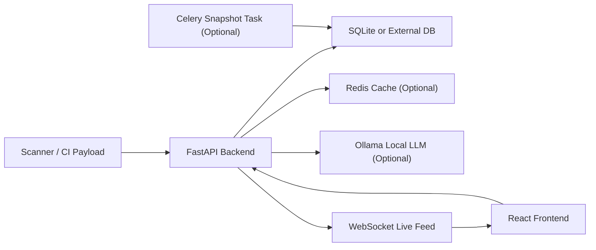

# ComplianceAI Dashboard

ComplianceAI Dashboard is a local-first compliance and security operations workspace built for demoing how scan findings can be turned into developer-friendly compliance evidence.

It combines:

- A `FastAPI` backend for ingestion, scoring, reporting, and AI-assisted analysis
- A `React + Vite` frontend for dashboards, findings triage, framework views, and audit workflows
- Optional `Redis`, `Celery`, and `Ollama` integrations for caching, scheduled snapshots, and local LLM features

The app is designed to help teams answer questions like:

- Which repositories are creating the most compliance risk?
- Which findings affect SOC 2, GDPR, HIPAA, PCI-DSS, OWASP, or ISO 27001?
- What changed between commits?
- Can we produce an auditor-friendly PDF summary from recent findings?
- Can developers ask a local AI assistant what matters and how to fix it?

## Table of Contents

- [What This Project Does](#what-this-project-does)
- [Key Features](#key-features)
- [Architecture](#architecture)
- [Tech Stack](#tech-stack)
- [Repository Layout](#repository-layout)
- [How the Product Works](#how-the-product-works)
- [Quick Start](#quick-start)
- [Detailed Local Setup](#detailed-local-setup)
- [Configuration](#configuration)
- [Demo Credentials](#demo-credentials)
- [Seed Demo Data](#seed-demo-data)
- [API Overview](#api-overview)
- [Sample Requests](#sample-requests)
- [Frontend Pages](#frontend-pages)
- [Data Model Summary](#data-model-summary)
- [Operational Notes](#operational-notes)
- [Known Limitations](#known-limitations)
- [Troubleshooting](#troubleshooting)
- [Development Notes](#development-notes)

## What This Project Does

At a high level, the dashboard ingests security findings, enriches them with compliance mappings, stores them in a local database, and presents them in a UI that is easier for engineering, security, and audit stakeholders to use.

The current implementation supports:

- Finding ingestion from a SARIF-like payload
- Compliance mapping and framework scoring
- Severity and pass-rate summaries
- Commit-oriented finding history
- Framework posture views
- PDF audit report generation
- Local-AI chat over recent findings
- Real-time toast notifications for newly ingested findings
- Demo seeding for findings and compliance snapshots

This repo is especially useful as a hackathon/demo project, internal prototype, or starting point for a richer compliance operations product.

## Key Features

### Backend capabilities

- `JWT demo auth` for login, protected finding ingestion, and protected status updates
- `Finding enrichment` with:
  - mapped frameworks
  - control clauses
  - risk score
  - risk justification
  - plain-English explanation fields
- `Framework scoring` for:
  - SOC 2
  - GDPR
  - HIPAA
  - PCI-DSS
  - OWASP
  - ISO 27001
- `Live WebSocket feed` at `/ws/live` for newly created findings
- `PDF audit export` with:
  - AI narrative when Ollama is available
  - severity summary table
  - framework compliance table
  - top violated control clauses
- `Caching` backed by Redis when available, with in-memory fallback
- `Startup migrations` that add missing columns to legacy databases

### Frontend capabilities

- Login screen with persisted auth token in local storage
- Dashboard overview with KPI cards, trend chart, and severity donut
- Findings explorer with filters for severity, status, repository, framework, and commit
- Findings detail side panel with:
  - risk score
  - compliance mappings
  - AI fix suggestion
  - status updates
- Framework posture screen with clickable compliance bars
- Audit screen for PDF generation and recent report history
- AI assistant screen with streaming responses
- Live toast notifications when new findings arrive

## Architecture



### Request/data flow

1. A scan pipeline submits findings to `POST /api/v1/findings`.
2. The backend normalizes each result and enriches it with compliance metadata.
3. Findings are saved to the database.
4. Cached summaries/framework scores are invalidated.
5. A WebSocket event is broadcast for each newly created finding.
6. The frontend refreshes dashboards and can show live notification toasts.
7. Users can review findings, update status, inspect mapped controls, or export an audit PDF.

## Tech Stack

### Frontend

- `React 19`
- `TypeScript`
- `Vite`
- `TanStack Router`
- `Zustand`
- `Chart.js` / `react-chartjs-2`
- Tailwind tooling is present, though most of the UI is authored with inline styles and custom CSS

### Backend

- `FastAPI`
- `SQLAlchemy`
- `Pydantic`
- `Uvicorn`
- `python-jose` for JWT handling
- `ReportLab` for PDF generation
- `httpx` for Ollama calls
- `Redis` client with graceful fallback
- `Celery` for optional scheduled jobs

## Repository Layout

```text
dashboard/
├── README.md
├── backend/
│   ├── main.py
│   ├── database.py
│   ├── models.py
│   ├── migrations.py
│   ├── compliance_mapping.py
│   ├── cache.py
│   ├── websocket_manager.py
│   ├── seed_data.py
│   ├── workers/
│   │   └── nightly_snapshot.py
│   └── routers/
│       ├── auth.py
│       ├── findings.py
│       ├── frameworks.py
│       ├── audit.py
│       └── ai_chat.py
└── frontend/
    ├── package.json
    ├── vite.config.ts
    └── src/
        ├── routes/
        ├── components/
        ├── api/
        └── store/
```

## How the Product Works

### 1. Findings ingestion

The backend expects a SARIF-style payload with:

- `commit_sha`
- `runs`
- `runs[0].results[]`

For each result, the backend extracts:

- `ruleId`
- finding message
- file path
- line number
- scanner metadata
- severity
- AI/plain-English fields when present
- false-positive flag when present

It also derives the repository name from the first segment of `file_path`.

### 2. Compliance enrichment

Each finding is run through the compliance mapping logic in `backend/compliance_mapping.py`, which adds:

- a primary category/framework label
- mapped framework entries
- control clause metadata
- confidence scores
- risk score
- risk justification

### 3. Summary and scoring

The backend computes:

- severity totals
- pass rate based on findings marked `fixed` or `accepted`
- 14-day trend data
- framework posture percentages

### 4. Live updates

When new findings are created, the backend broadcasts them over `/ws/live`. The frontend listens and shows toast notifications while prepending the new finding into state.

### 5. Audit reporting

The audit route aggregates findings for a date range and produces a downloadable PDF. When Ollama is available, the report includes a locally generated compliance narrative. If Ollama is offline, the PDF still generates with a fallback message.

### 6. AI assistant

The chat feature sends the user question plus a summary of the 20 most recent findings to Ollama, then streams the answer back to the browser.

## Quick Start

If you want the fastest path to a working local demo:

### 1. Start the backend

```bash
cd /Users/sukeerth/Desktop/Buildx/dashboard/backend
python3 -m venv .venv
source .venv/bin/activate
pip install -r requirements.txt
uvicorn main:app --reload --port 8000
```

### 2. Seed demo data

In another terminal:

```bash
cd /Users/sukeerth/Desktop/Buildx/dashboard/backend
source .venv/bin/activate
python seed_data.py
```

### 3. Start the frontend

```bash
cd /Users/sukeerth/Desktop/Buildx/dashboard/frontend
npm install
npm run dev
```

### 4. Open the app

- Frontend: [http://localhost:5173](http://localhost:5173)
- Backend API: [http://localhost:8000](http://localhost:8000)
- FastAPI docs: [http://localhost:8000/docs](http://localhost:8000/docs)

### 5. Sign in

- Username: `admin`
- Password: `compliance2026`

## Detailed Local Setup

### Prerequisites

- Python `3.11+` recommended
- Node.js `20+` recommended
- npm
- Optional:
  - Redis
  - Ollama

### Backend setup

```bash
cd /Users/sukeerth/Desktop/Buildx/dashboard/backend
python3 -m venv .venv
source .venv/bin/activate
pip install -r requirements.txt
```

Run the API:

```bash
uvicorn main:app --reload --port 8000
```

Important behavior on startup:

- SQLAlchemy creates ORM tables if they do not exist
- `run_migrations()` adds missing columns to legacy `findings` tables
- `backfill_legacy_findings()` enriches older rows that are missing compliance metadata

### Frontend setup

```bash
cd /Users/sukeerth/Desktop/Buildx/dashboard/frontend
npm install
npm run dev
```

By default, the frontend talks to `http://localhost:8000`.

### Optional Redis setup

Redis is not required for local development. If Redis is unavailable:

- cache reads/writes fall back to a process-local in-memory dictionary
- the app still works for demo/local usage

If you do want Redis locally:

```bash
docker run -d --name complianceai-redis -p 6379:6379 redis:7
```

### Optional Ollama setup

Ollama is used for:

- `/api/v1/ai/chat`
- AI-generated narrative content inside `/api/v1/audit/generate`

Start Ollama and pull the default model:

```bash
ollama serve
ollama pull llama3.1:8b
```

If Ollama is not running:

- chat returns an offline message
- audit PDF generation still works, but with a fallback narrative

### Optional Celery worker

There is a Celery task at `backend/workers/nightly_snapshot.py` that can create daily framework snapshots. Redis is used as the default broker URL.

This repo includes the task definition, but it does not include a scheduler configuration out of the box. In its current form, treat it as an optional hook for future automation rather than a fully wired background job system.

## Configuration

### Backend environment variables

The backend loads environment variables from `backend/.env` if that file exists.

Supported variables used by the current codebase:

| Variable | Default | Purpose |
| --- | --- | --- |
| `DATABASE_URL` | `sqlite:///./complianceai.db` | SQLAlchemy connection string |
| `REDIS_URL` | `redis://localhost:6379` | Redis cache and Celery broker URL |
| `OLLAMA_URL` | `http://localhost:11434/api/generate` | LLM endpoint for audit generation |
| `OLLAMA_MODEL` | `llama3.1:8b` | Model used for audit narrative generation |

Example `backend/.env`:

```env
DATABASE_URL=sqlite:///./complianceai.db
REDIS_URL=redis://localhost:6379
OLLAMA_URL=http://localhost:11434/api/generate
OLLAMA_MODEL=llama3.1:8b
```

### Frontend environment variables

The frontend reads:

| Variable | Default | Purpose |
| --- | --- | --- |
| `VITE_API_BASE_URL` | `http://localhost:8000` | Base URL for API and WebSocket derivation |

Example `frontend/.env`:

```env
VITE_API_BASE_URL=http://localhost:8000
```

## Demo Credentials

The current login flow uses a hard-coded demo credential in `backend/routers/auth.py`.

- Username: `admin`
- Password: `compliance2026`

Notes:

- The UI requires a token for normal usage
- The backend uses JWT login and currently protects finding creation and status updates
- This is demo auth, not production auth

## Seed Demo Data

Use the seeder to populate 30 days of sample findings and framework snapshots:

```bash
cd /Users/sukeerth/Desktop/Buildx/dashboard/backend
source .venv/bin/activate
python seed_data.py
```

What it does:

- creates tables if needed
- deletes existing `findings` and `framework_snapshots`
- inserts synthetic findings across sample repositories
- inserts 30 days of sample compliance snapshots

Important:

- This script is destructive for local data in those two tables

## API Overview

Base URL: `http://localhost:8000`

### Health

| Method | Path | Description |
| --- | --- | --- |
| `GET` | `/health` | Simple health check |

### Auth

| Method | Path | Description |
| --- | --- | --- |
| `POST` | `/api/v1/auth/login` | Get a JWT access token |

### Findings

| Method | Path | Auth | Description |
| --- | --- | --- | --- |
| `POST` | `/api/v1/findings` | Yes | Ingest findings payload |
| `GET` | `/api/v1/findings` | No | List findings with optional filters |
| `GET` | `/api/v1/findings/summary` | No | Severity totals and pass rate |
| `GET` | `/api/v1/findings/trend` | No | 14-day pass-rate trend |
| `PATCH` | `/api/v1/findings/{id}/status` | Yes | Update finding status |

Supported server-side query filters for `GET /api/v1/findings`:

- `severity`
- `status`
- `repo`
- `framework`

### Frameworks

| Method | Path | Description |
| --- | --- | --- |
| `GET` | `/api/v1/frameworks` | Get current framework posture scores |
| `GET` | `/api/v1/frameworks/snapshots` | Get the most recent 30 snapshots |

### Audit

| Method | Path | Description |
| --- | --- | --- |
| `POST` | `/api/v1/audit/generate` | Generate a PDF report for a date range |

### AI

| Method | Path | Description |
| --- | --- | --- |
| `POST` | `/api/v1/ai/chat` | Stream a local-AI response |
| `WS` | `/ws/live` | Live feed for newly ingested findings |

## Sample Requests

### 1. Login

```bash
curl -X POST http://localhost:8000/api/v1/auth/login \
  -H "Content-Type: application/json" \
  -d '{
    "username": "admin",
    "password": "compliance2026"
  }'
```

### 2. Ingest findings

Replace `<TOKEN>` with the JWT returned from login.

```bash
curl -X POST http://localhost:8000/api/v1/findings \
  -H "Authorization: Bearer <TOKEN>" \
  -H "Content-Type: application/json" \
  -d '{
    "commit_sha": "abc123def456",
    "runs": [
      {
        "results": [
          {
            "ruleId": "B105",
            "message": { "text": "Hardcoded password string detected" },
            "locations": [
              {
                "physicalLocation": {
                  "artifactLocation": { "uri": "auth-service/src/settings.py" },
                  "region": { "startLine": 42 }
                }
              }
            ],
            "properties": {
              "severity": "CRITICAL",
              "fix": "Move the secret to environment variables or a secret manager.",
              "scanner": "bandit",
              "plain_english": "A password is stored directly in code.",
              "is_false_positive": false
            }
          }
        ]
      }
    ]
  }'
```

### 3. Fetch summary

```bash
curl http://localhost:8000/api/v1/findings/summary
```

### 4. Generate audit PDF

```bash
curl -X POST http://localhost:8000/api/v1/audit/generate \
  -H "Content-Type: application/json" \
  -d '{
    "start_date": "2026-04-01",
    "end_date": "2026-04-25"
  }' \
  --output audit_report.pdf
```

### 5. Ask the AI assistant

```bash
curl -X POST http://localhost:8000/api/v1/ai/chat \
  -H "Content-Type: application/json" \
  -d '{
    "message": "What are our top critical risks right now?"
  }'
```

## Frontend Pages

### `/login`

- Demo sign-in page
- Persists the JWT in local storage under `compliance_token`

### `/`

- Main dashboard overview
- KPI cards for critical/high counts, pass rate, and estimated audit hours saved
- Trend chart
- Severity donut
- Top repositories and top violated rules

### `/findings`

- Main triage screen
- Filters by severity, status, repository, framework, and commit
- Clickable rows open a detailed side panel
- Detail view exposes:
  - compliance mappings
  - risk analysis
  - fix suggestion
  - plain-English explanation
  - mutable status

### `/frameworks`

- Framework posture bars for six frameworks
- Clicking a framework routes the user to findings filtered by that framework

### `/audit`

- Date-range form for PDF export
- Recent report history stored in local storage
- Nightly snapshot log table

### `/chat`

- Streaming chat experience backed by local Ollama
- Starter prompts for common compliance questions

## Data Model Summary

### `Finding`

Primary fields currently stored:

- `repo`
- `file_path`
- `line_number`
- `rule_id`
- `severity`
- `message`
- `fix_suggestion`
- `framework`
- `compliance_mappings`
- `risk_score`
- `risk_justification`
- `commit_sha`
- `scanner`
- `plain_english`
- `is_false_positive`
- `status`
- `created_at`

### `FrameworkSnapshot`

Tracks compliance posture by date for:

- `soc2`
- `gdpr`
- `hipaa`
- `pcidss`
- `owasp`
- `iso27001`

## Operational Notes

### Database behavior

- Default local development uses SQLite
- If you run the backend from `backend/`, the default DB file is `backend/complianceai.db`
- You can swap to PostgreSQL or another SQLAlchemy-supported database via `DATABASE_URL`

### Caching behavior

- Redis is attempted first
- If Redis is down, the app silently falls back to in-memory cache
- This is convenient for local work, but it is not a substitute for shared cache infrastructure in multi-instance deployments

### AI behavior

- The audit route uses configurable `OLLAMA_URL` and `OLLAMA_MODEL`
- The chat route currently uses a hard-coded Ollama endpoint and model in `backend/routers/ai_chat.py`
- Both AI features are designed for local-only use

### WebSocket behavior

- The frontend derives the WebSocket URL from `VITE_API_BASE_URL`
- Example: `http://localhost:8000` becomes `ws://localhost:8000/ws/live`

### Migrations/backfill behavior

- Startup migrations are lightweight column checks, not a full migration framework like Alembic
- Legacy findings are backfilled with mapping/risk metadata during startup when needed

## Known Limitations

- Authentication is demo-grade and uses hard-coded credentials plus a hard-coded secret key
- The dashboard folder does not currently include automated backend or frontend tests
- Findings listing is not paginated
- Some routes are open even though the UI expects login for the normal user flow
- The Celery snapshot task exists, but scheduling/orchestration is not fully wired in this repo
- The AI chat route hard-codes its Ollama URL/model instead of fully sharing the audit route configuration
- The current README describes the dashboard only; broader scanner orchestration may live elsewhere in the larger project

## Troubleshooting

### Frontend cannot reach backend

Check:

- backend is running on port `8000`
- `frontend/.env` has the correct `VITE_API_BASE_URL`
- CORS currently allows common localhost Vite ports such as `5173`, `5174`, and `5175`

### Login fails

Make sure you are using:

- username `admin`
- password `compliance2026`

### Chat says the AI service is offline

Check:

- Ollama is running
- the default Ollama API is reachable at `http://localhost:11434`
- model `llama3.1:8b` has been pulled locally

### Audit PDF generates but narrative is generic/offline

That usually means:

- Ollama is unavailable
- the model request timed out
- the LLM returned a non-200 response

The PDF route is intentionally resilient and still returns a document.

### Redis is not running

That is acceptable for local development. The app falls back to in-memory caching automatically.

## Development Notes

### Useful commands

Backend:

```bash
cd /Users/sukeerth/Desktop/Buildx/dashboard/backend
source .venv/bin/activate
uvicorn main:app --reload --port 8000
```

Frontend:

```bash
cd /Users/sukeerth/Desktop/Buildx/dashboard/frontend
npm run dev
```

Frontend production build:

```bash
cd /Users/sukeerth/Desktop/Buildx/dashboard/frontend
npm run build
```

Frontend lint:

```bash
cd /Users/sukeerth/Desktop/Buildx/dashboard/frontend
npm run lint
```

Seed/reset local demo data:

```bash
cd /Users/sukeerth/Desktop/Buildx/dashboard/backend
source .venv/bin/activate
python seed_data.py
```

### Suggested next improvements

- Move auth secrets and credentials fully into environment variables
- Add pagination, sorting, and search to findings APIs
- Introduce Alembic migrations
- Add test coverage for ingestion, framework scoring, and PDF generation
- Add a real scheduler for nightly snapshots
- Align all AI configuration behind shared environment-based settings

## Summary

This dashboard already provides a strong local demo of a compliance workflow:

- ingest findings
- map them to frameworks
- show posture and trends
- triage issues in a UI
- stream local AI guidance
- export auditor-friendly PDF evidence

If you want to extend it, the best next areas are stronger auth, better automation, and production-grade persistence/testing.
