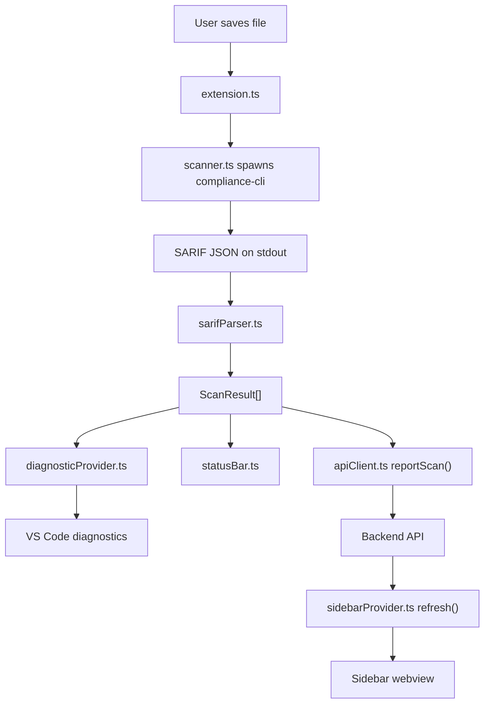

# ComplianceAI VS Code Extension

ComplianceAI is a Visual Studio Code extension that runs a local `compliance-cli` scan against the current file, parses SARIF output, shows findings as editor diagnostics, and surfaces compliance information in the status bar and a sidebar dashboard.

This repository contains the extension layer only. It depends on:

- a companion CLI named `compliance-cli`
- an optional backend service for dashboard data and scan uploads

The project is currently a hackathon-style prototype. A few features are fully working, a few are partially wired, and a few are declared in the manifest but not finished yet. This README is intentionally detailed and describes the code as it exists today.

## Table of Contents

- [What the extension does](#what-the-extension-does)
- [Current implementation status](#current-implementation-status)
- [Architecture overview](#architecture-overview)
- [Repository structure](#repository-structure)
- [Requirements](#requirements)
- [Getting started for development](#getting-started-for-development)
- [Running the extension](#running-the-extension)
- [Supported files and activation behavior](#supported-files-and-activation-behavior)
- [Commands](#commands)
- [Configuration](#configuration)
- [How a scan flows through the system](#how-a-scan-flows-through-the-system)
- [Backend integration](#backend-integration)
- [Manual testing with the included fixture](#manual-testing-with-the-included-fixture)
- [Output logs and debugging](#output-logs-and-debugging)
- [Troubleshooting](#troubleshooting)
- [Known limitations](#known-limitations)
- [Suggested next improvements](#suggested-next-improvements)
- [License](#license)

## What the extension does

At a high level, the extension does the following:

1. Activates when VS Code opens supported file types such as Python, TypeScript, YAML, or Terraform.
2. Watches for file saves.
3. On save, runs `compliance-cli scan --file <path> --format sarif`.
4. Parses the CLI SARIF output into internal `ScanResult` objects.
5. Converts findings into VS Code diagnostics so the editor can show squiggles and Problems entries.
6. Provides hover details for those diagnostics.
7. Shows a quick-fix action entry for findings.
8. Updates a status bar item with the current issue counts.
9. Refreshes a sidebar dashboard by calling a backend API.
10. Optionally uploads scan results to the backend when a JWT token is configured.

## Current implementation status

The table below reflects the current code, not an aspirational roadmap.

| Area | Status | Notes |
| --- | --- | --- |
| Auto-scan on save | Implemented | Triggered from `workspace.onDidSaveTextDocument` when `complianceai.enableAutoScan` is `true`. |
| Manual scan command | Implemented | `complianceai.scan` scans the active editor document. |
| SARIF parsing | Implemented | `src/sarifParser.ts` reads the first SARIF run and maps results into `ScanResult`. |
| Diagnostics / squiggles | Implemented | `src/diagnosticProvider.ts` publishes findings as VS Code diagnostics. |
| Hover details | Implemented | `src/hoverProvider.ts` shows severity, framework, optional plain-English text, and fix guidance. |
| Quick-fix menu entry | Partially implemented | The lightbulb action appears, but the command currently logs arguments and does not edit the file. |
| Sidebar dashboard | Implemented with backend dependency | The webview loads and refreshes from the configured backend API. |
| Status bar summary | Implemented | Shows Ready, Scanning, Error, or issue counts by severity. |
| Scan upload to backend | Implemented | Only happens when `complianceai.jwtToken` is set. |
| Clear diagnostics command | Not wired | Declared in `package.json`, but no command handler is registered in `src/extension.ts`. |
| Severity threshold filtering | Not wired | The setting exists in `package.json`, but findings are not filtered by this value in the current code. |
| Scan on file open | Present but disabled | There is a save/open listener; open-scan logic is intentionally commented out. |
| JavaScript activation | Partial | `.js` files are supported by the scanner logic, but `package.json` does not declare `onLanguage:javascript`. |

## Architecture overview

The extension is intentionally small and organized around a straightforward pipeline:



### Main components

#### `src/extension.ts`

This is the activation entry point and orchestration layer.

Responsibilities:

- creates the `ComplianceAI` output channel
- constructs the scanner, diagnostics, sidebar, API client, and status bar manager
- registers hover and code action providers
- listens for file saves
- registers manual commands
- coordinates the complete scan flow in `handleFileScan(...)`

#### `src/scanner.ts`

This file bridges VS Code to the external CLI.

Responsibilities:

- spawns `compliance-cli` using Node's `child_process.spawn`
- passes `scan --file <path> --format sarif`
- collects stdout and stderr
- treats stdout as SARIF JSON
- returns `ScanResult[] | null`

Important implementation detail:

- if the CLI is missing or exits unsuccessfully, the method resolves `null`
- if the CLI prints no stdout, the method resolves an empty array

#### `src/sarifParser.ts`

This file converts SARIF into the extension's internal model.

It currently expects:

- `runs[0].results`
- `ruleId`
- `message.text`
- `locations[0].physicalLocation.artifactLocation.uri`
- `locations[0].physicalLocation.region.startLine`
- `properties.severity`
- `properties.fix`
- `properties.framework`

Only findings with a file path and a positive line number are kept.

#### `src/diagnosticProvider.ts`

This file converts scan results into `vscode.Diagnostic` instances.

Behavior:

- `CRITICAL` and `HIGH` become `Error`
- `MEDIUM` becomes `Warning`
- `LOW` becomes `Information`
- the full line is marked as the diagnostic range
- results are cached in memory for the hover and code-action providers

#### `src/hoverProvider.ts`

This file builds the hover tooltip shown over a ComplianceAI diagnostic.

The hover can include:

- rule ID and message
- severity badge
- scanner attribution if present in the finding payload
- framework label
- optional plain-English explanation if present in the finding payload
- fix suggestion
- links for "Learn more" and "Apply Fix"

Note:

- the hover link for Apply Fix calls `complianceai.applyFix`
- that command is currently registered but does not modify the document yet

#### `src/codeActionProvider.ts`

This file adds quick-fix entries when a ComplianceAI diagnostic is selected.

It currently adds:

- `Apply Fix: <ruleId>` as a quick fix
- `Framework: <framework>` as an informational action

The quick-fix command is present, but the actual edit application is not yet implemented.

#### `src/statusBar.ts`

This file manages two status bar items:

- a main ComplianceAI status item
- a secondary privacy badge labeled `Air-Gapped`

Current states:

- Ready
- Scanning
- Error
- issue counts grouped by severity

Important nuance:

- the UI shows an `Air-Gapped` badge
- however, the extension can still call a backend over HTTP for dashboard reads and scan uploads
- treat the badge as current UI copy, not as a full network-isolation guarantee

#### `src/sidebarProvider.ts`

This file renders the activity-bar sidebar webview.

The sidebar displays:

- overall score
- counts for critical, high, medium, and low findings
- up to three open findings
- buttons for scan and refresh

The sidebar depends on backend responses. Without the backend, it shows an error message.

#### `src/apiClient.ts`

This file owns all backend HTTP communication through Axios.

It:

- reads `complianceai.backendUrl`
- fetches dashboard summary and findings
- transforms backend responses into `DashboardData`
- uploads scan results when a JWT token exists

## Repository structure

```text
extension/
├── src/
│   ├── apiClient.ts
│   ├── codeActionProvider.ts
│   ├── diagnosticProvider.ts
│   ├── extension.ts
│   ├── hoverProvider.ts
│   ├── sarifParser.ts
│   ├── scanner.ts
│   ├── sidebarProvider.ts
│   ├── statusBar.ts
│   └── types.ts
├── out/                      # Compiled JavaScript output
├── test-fixtures/
│   └── vulnerable.py         # Manual QA file with intentionally unsafe patterns
├── BUILD_REPORT.md
├── COMPLETION_SUMMARY.md
├── DEVELOPMENT.md
├── FILE_INVENTORY.md
├── QUICK_REFERENCE.md
├── READY_TO_TEST.md
├── START_HERE.md
├── TEAM_HANDOFF.md
├── WEEK4_TESTING.md
├── WHATS_BEEN_BUILT.md
├── package-lock.json
├── package.json
├── README.md
└── tsconfig.json
```

Additional documentation files already exist in the repository, but this README should be the best entry point for understanding how the extension works right now.

## Requirements

To run the extension successfully, you need:

- VS Code `1.85.0` or newer, based on `package.json`
- Node.js and npm for installing dependencies and compiling TypeScript
- the companion `compliance-cli` executable available on your `PATH`
- an optional backend at `http://localhost:8000` or another configured URL if you want sidebar data and uploads

The extension itself depends on:

- `axios`
- the VS Code extension host runtime

## Getting started for development

### 1. Install dependencies

```bash
npm install
```

### 2. Compile the extension

```bash
npm run compile
```

### 3. Start watch mode while editing

```bash
npm run watch
```

### 4. Launch the extension in VS Code

Open this folder in VS Code and press `F5`. VS Code will launch an Extension Development Host window with ComplianceAI loaded from source.

### 5. Make sure the CLI exists

The extension shell-outs to `compliance-cli`, so verify it before testing:

```bash
which compliance-cli
compliance-cli --version
```

If the CLI is not installed or not on `PATH`, scans will not succeed.

## Running the extension

Once the Extension Development Host opens:

1. Open a supported file such as a Python or TypeScript file.
2. Save the file.
3. Watch the status bar for the scanning state.
4. Open `View -> Output` and switch the channel to `ComplianceAI` if you want detailed logs.
5. Open the ComplianceAI activity-bar view to see the sidebar dashboard.

If the backend is not running, editor diagnostics can still work as long as the CLI works, but the sidebar will show an error and backend sync will fail or be skipped.

## Supported files and activation behavior

### Files scanned by the save handler

The runtime save logic checks these extensions:

- `.py`
- `.tf`
- `.yaml`
- `.yml`
- `.ts`
- `.js`

### Languages registered for hovers and code actions

The extension registers providers for:

- `python`
- `terraform`
- `yaml`
- `typescript`
- `javascript`

### Activation events declared in `package.json`

The extension currently activates on:

- `onLanguage:python`
- `onLanguage:typescript`
- `onLanguage:yaml`
- `onLanguage:terraform`

Important detail:

- JavaScript is handled in code, but there is no `onLanguage:javascript` activation event in the manifest.
- In practice, that means JavaScript support is only partial unless the extension has already been activated by another supported trigger.

## Commands

The command surface is slightly split between manifest-declared commands and runtime-only commands.

| Command ID | Title / Usage | Status | Notes |
| --- | --- | --- | --- |
| `complianceai.scan` | `ComplianceAI: Run Scan` | Implemented | Scans the active editor document. |
| `complianceai.clearDiagnostics` | `ComplianceAI: Clear Diagnostics` | Not implemented | Declared in `package.json`, but no handler is registered in `src/extension.ts`. |
| `complianceai.applyFix` | Internal quick-fix command | Partially implemented | Registered at runtime, but currently logs arguments only. |
| `complianceai.showDashboard` | Internal status bar command | Implemented | Used when clicking the status bar item to focus the sidebar view. |

Notes:

- there is currently no default keyboard shortcut declared in `package.json`
- manual scan is available through the Command Palette via `ComplianceAI: Run Scan`
- the sidebar also exposes a `Scan Current File` button that posts back to the extension and runs `complianceai.scan`

## Configuration

The extension contributes these settings under the `complianceai` namespace.

| Setting | Default | Used today? | Details |
| --- | --- | --- | --- |
| `complianceai.jwtToken` | empty string | Yes | Used only when uploading findings with `POST /api/v1/findings`. |
| `complianceai.backendUrl` | `http://localhost:8000` | Yes | Used by the Axios client for dashboard reads and uploads. |
| `complianceai.enableAutoScan` | `true` | Yes | Controls whether scans happen on file save. |
| `complianceai.severityThreshold` | `MEDIUM` | No | Declared in the manifest, but not currently applied to filtering or display logic. |

Example `settings.json`:

```json
{
  "complianceai.backendUrl": "http://localhost:8000",
  "complianceai.jwtToken": "your-jwt-token",
  "complianceai.enableAutoScan": true,
  "complianceai.severityThreshold": "MEDIUM"
}
```

## How a scan flows through the system

This section describes the exact runtime path when you save a supported file.

### 1. Save event

`src/extension.ts` listens to `workspace.onDidSaveTextDocument(...)`.

Before scanning, it checks:

- whether auto-scan is enabled
- whether the file extension is supported

### 2. Status bar enters loading state

`StatusBarManager.setLoading()` changes the main item to a scanning message.

### 3. CLI invocation

`Scanner.scanFile(filePath)` runs:

```bash
compliance-cli scan --file /absolute/path/to/file --format sarif
```

The scanner:

- captures stdout as SARIF JSON
- captures stderr for logging
- does not use a shell

### 4. SARIF parsing

`SarifParser.parse(...)` maps each finding into:

- `ruleId`
- `message`
- `filePath`
- `line`
- `severity`
- `fix`
- `framework`

### 5. Diagnostics are published

`DiagnosticProvider.createDiagnostics(...)` creates a full-line `vscode.Diagnostic` for each finding and publishes them to the current file URI.

### 6. Status bar summary updates

The extension counts findings by severity and updates the main status bar item.

Examples:

- `ComplianceAI: Ready`
- `ComplianceAI: Scanning...`
- `ComplianceAI: All Clear`
- `ComplianceAI: 🔴 1 Critical | 🟠 2 High`

### 7. Optional backend upload

The extension builds a SARIF-like report payload and calls `ApiClient.reportScan(...)`.

Behavior:

- if no JWT token is configured, upload is skipped
- if a JWT token exists, the extension sends a `POST /api/v1/findings`

### 8. Sidebar refresh

After a scan, the extension calls `sidebarProvider.refresh()` so the webview can re-fetch dashboard data from the backend.

### 9. Warning for critical findings

If one or more `CRITICAL` findings are present, the extension shows a VS Code warning message.

## Backend integration

The backend contract in the current implementation is defined by `src/apiClient.ts`.

### Read endpoints

The sidebar expects these endpoints to exist:

```text
GET /api/v1/findings/summary
GET /api/v1/findings
```

Expected summary shape:

```json
{
  "critical": 1,
  "high": 3,
  "medium": 5,
  "low": 2,
  "pass_rate": 78
}
```

Expected findings shape:

```json
[
  {
    "id": 1,
    "repo": "example-repo",
    "file_path": "src/app.py",
    "line_number": 42,
    "rule_id": "B105",
    "severity": "HIGH",
    "message": "Hardcoded secret found",
    "fix_suggestion": "Move secret to an environment variable",
    "framework": "OWASP",
    "commit_sha": "abc123",
    "status": "open",
    "created_at": "2026-04-25T10:00:00Z"
  }
]
```

### Upload endpoint

Uploads go to:

```text
POST /api/v1/findings
```

The upload request includes:

- `Authorization: Bearer <jwt>` when `complianceai.jwtToken` is set
- `commit_sha`, defaulting to `local-scan`
- a `runs` payload containing the current findings

### Important auth nuance

Current code behavior is:

- dashboard reads do not attach the JWT token
- only uploads use the JWT token

If your backend requires auth for `GET` endpoints as well, the sidebar will need code changes.

## Manual testing with the included fixture

The repository includes `test-fixtures/vulnerable.py`, a file designed to trigger several findings.

### What the fixture contains

The file intentionally includes examples of:

- command injection
- SQL injection
- weak hashing
- hardcoded secrets
- `assert` in production code

### Suggested manual QA steps

1. Start the Extension Development Host with `F5`.
2. Open `test-fixtures/vulnerable.py`.
3. Save the file.
4. Check the editor for diagnostics.
5. Hover over a finding to inspect the hover UI.
6. Open the lightbulb menu for a finding.
7. Check the ComplianceAI output channel.
8. If the backend is running, open the sidebar and confirm it refreshes.

### Expected findings in the fixture

The inline comments in the test fixture call out expected hit locations around:

- line 20
- line 28
- line 36
- line 41
- line 42
- line 48

The exact findings still depend on what `compliance-cli` emits.

## Output logs and debugging

The extension writes detailed logs to the `ComplianceAI` output channel.

To view logs in VS Code:

1. Open `View -> Output`.
2. Select `ComplianceAI` from the channel dropdown.

Useful log categories include:

- extension activation
- file save/open events
- CLI spawn commands
- CLI stderr
- SARIF parsing results
- backend requests
- sidebar refresh attempts

Examples of useful messages you may see:

- `ComplianceAI extension activated`
- `[Scanner] Spawning: compliance-cli scan --file ... --format sarif`
- `[Scanner] Parsed X results from SARIF`
- `[ApiClient] Initialized with baseURL: http://localhost:8000`
- `[Sidebar] Fetching dashboard data...`

## Troubleshooting

### No diagnostics appear after saving a file

Check the following:

- the file extension is one of the supported extensions
- `complianceai.enableAutoScan` is still `true`
- `compliance-cli` is installed and available on `PATH`
- the CLI actually emits valid SARIF JSON to stdout
- the extension is activated in the current window

Open the `ComplianceAI` output channel first. That is the fastest way to see where the pipeline failed.

### The sidebar shows an error

Likely causes:

- the backend is not running
- `complianceai.backendUrl` is wrong
- the backend response shape does not match what `apiClient.ts` expects
- the backend requires auth for reads, but the extension only authenticates uploads

### The quick fix appears but does not change the file

This is expected in the current codebase. The quick-fix command is surfaced in the UI, but the edit application logic has not been implemented yet.

### The `Clear Diagnostics` command does not work

This is also expected right now. The command is contributed in the extension manifest, but no runtime handler is registered.

### JavaScript files do not trigger the extension reliably

The save logic supports `.js`, but the manifest is missing `onLanguage:javascript`. Add that activation event if JavaScript-first usage matters.

### Uploads never reach the backend

Check:

- `complianceai.jwtToken` is set
- the backend accepts `POST /api/v1/findings`
- the backend accepts the current payload format
- the output channel does not show upload errors

## Known limitations

This section is the most important one for anyone picking up the project.

### Product limitations

- the extension cannot scan without the external `compliance-cli`
- the sidebar is backend-dependent
- the status bar privacy badge currently overstates the network story because backend calls still exist
- there is no built-in packaging or publishing workflow in `package.json`

### Implementation limitations

- `complianceai.applyFix` is registered but does not apply edits
- `complianceai.clearDiagnostics` is declared but not implemented
- `complianceai.severityThreshold` is declared but unused
- JavaScript is supported in code but not fully supported by activation events
- scan-on-open logic is commented out
- no automated test suite is present in this extension package
- no lint script is currently declared in `package.json`

### Documentation limitations that existed before this rewrite

The previous README and some companion docs described behaviors that are not fully true in the code today, including:

- a working one-click fix flow
- a working clear-diagnostics command
- a default manual-scan keyboard shortcut
- a fully air-gapped experience
- settings and endpoints that differ from the actual implementation

## Suggested next improvements

If you want to take the project from prototype to polished extension, these are the highest-value follow-ups:

1. Implement `complianceai.applyFix` so it creates a real `WorkspaceEdit`.
2. Register `complianceai.clearDiagnostics` and call `DiagnosticProvider.clear()`.
3. Enforce `complianceai.severityThreshold` before publishing diagnostics.
4. Add `onLanguage:javascript` to `activationEvents`.
5. Decide whether backend reads should also use JWT auth.
6. Reword or remove the `Air-Gapped` badge if backend connectivity remains part of the design.
7. Add extension tests for SARIF parsing, diagnostics, and command behavior.
8. Add package scripts for linting, testing, and packaging.
9. Add a real `LICENSE` file before distributing the project more broadly.

## License

No standalone license file is currently checked into this repository.

If this project is meant to be shared, published, or reused outside the hackathon context, add a `LICENSE` file and update the metadata to match it.
